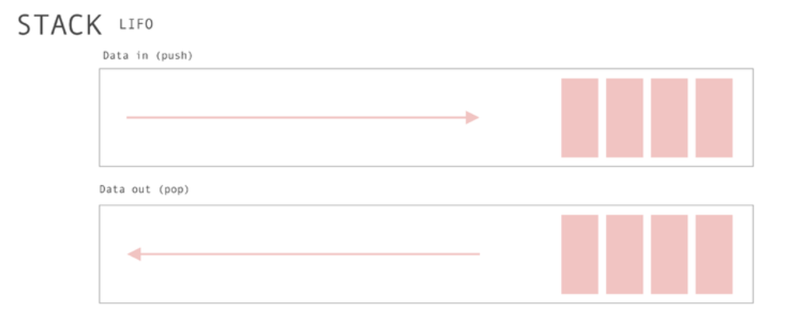

## Linked list

Stack một kiểu dữ liệu trừu tượng phục vụ như một bộ sưu tập các phần tử, với hai hoạt động chính:

- Push thêm một phần tử vào danh sách
- Pop loại bỏ phần tử được thêm gần nhất mà chưa được loại bỏ

Thứ tự mà các phần tử được lấy ra khỏi ngăn xếp dẫn đến tên gọi thay thế của nó, là LIFO (last in, first out).
Ngoài ra, một hoạt động nhìn có thể cung cấp quyền truy cập vào phần trên mà không làm thay đổi ngăn xếp. 
Tên "ngăn xếp" cho loại cấu trúc này đến từ sự tương tự với một bộ sưu tập các vật phẩm vật lý được xếp chồng lên nhau, 
điều này làm cho việc lấy một vật phẩm ra khỏi đỉnh của ngăn xếp dễ dàng, 
trong khi để đến được một vật phẩm sâu hơn trong ngăn xếp có thể đòi hỏi việc lấy ra nhiều vật phẩm khác trước đó.

## Cài đặt Stack
- Sử dụng Array
- Sử dụng Linked List 

## Ưu điểm của Stack

-   Sử dụng Array
    - Dễ dàng cài đặt, tiết kiệm bộ nhớ hơn Linked List vì không cần thêm bộ nhớ để lưu pointer.

-   Sử dụng Linked List
    - Có thể dễ dàng tăng hoặc giảm kích thước của Stack ở thời điểm runtime.

## Nhược điểm của danh sách liên kết
-   Sử dụng Array
    - Không dynamic. Không thể tăng hoặc giảm kích thước Stack ở thời điểm runtime.

-   Sử dụng Linked List
    - Tốn thêm bộ nhớ để lưu trữ pointer.

Xem thêm tại [Github](https://github.com/dinhbt28/js-algorithms/blob/main/src/data-structures/stack)

